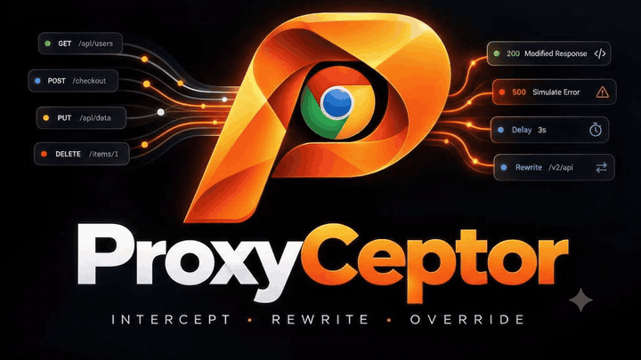
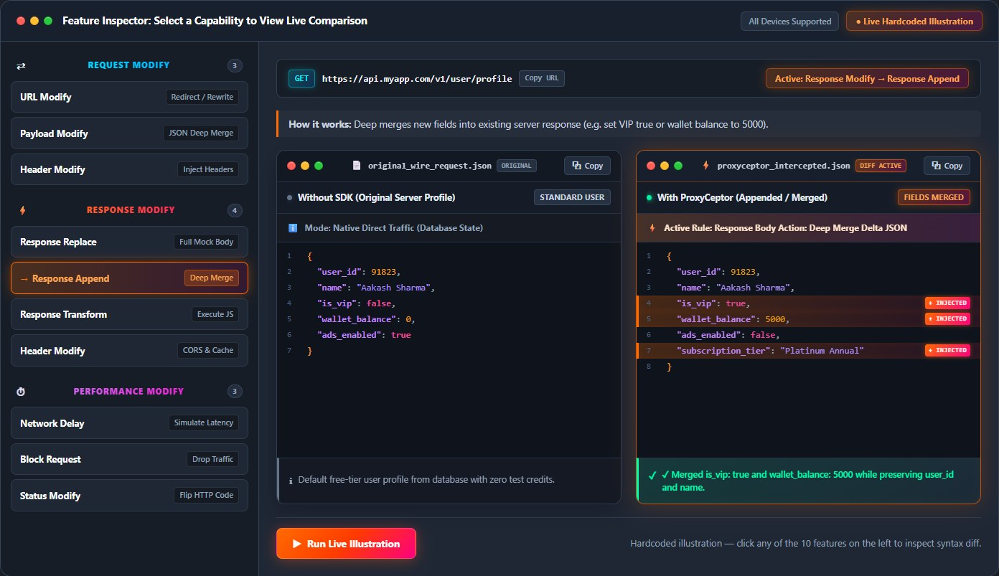
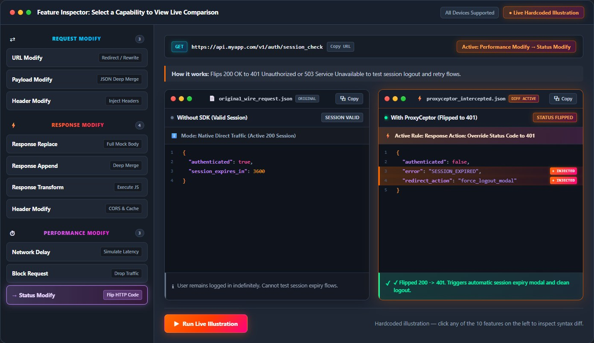
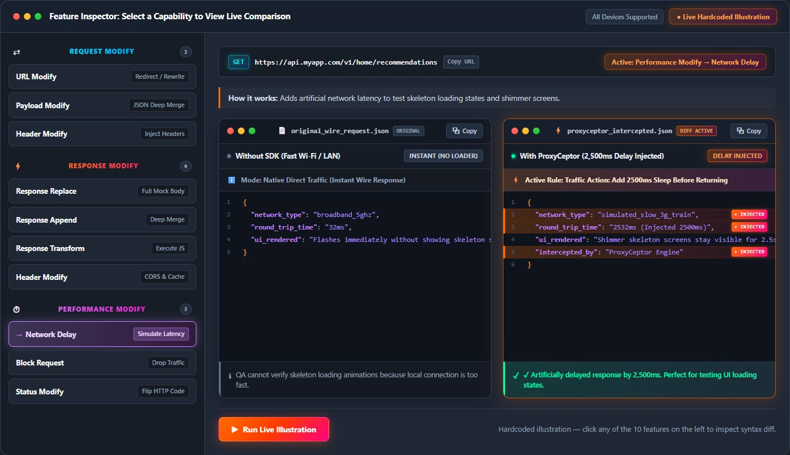
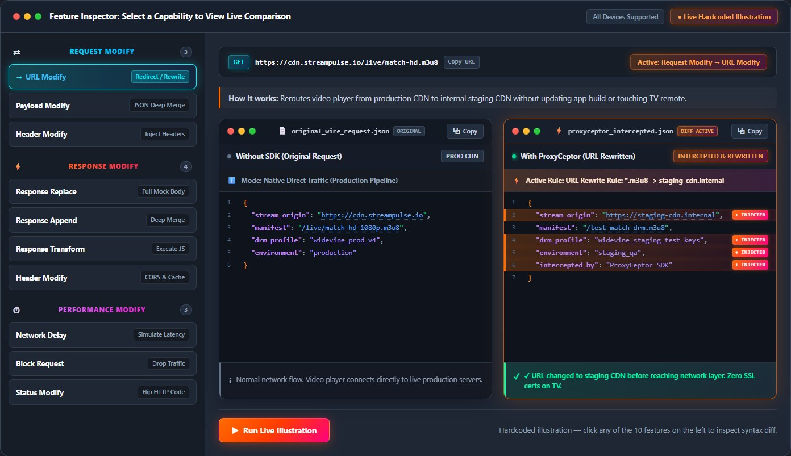
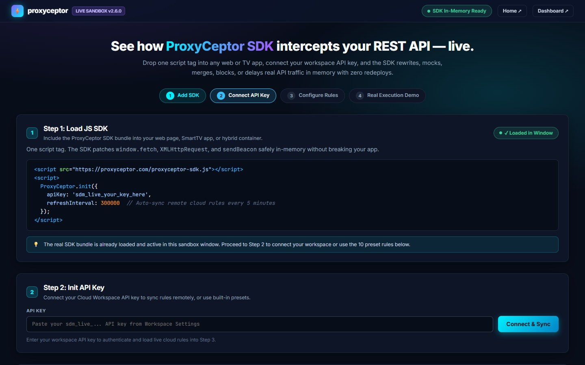
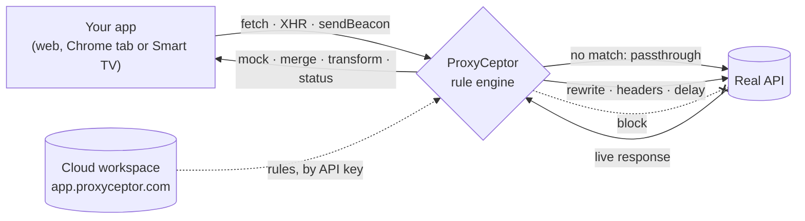
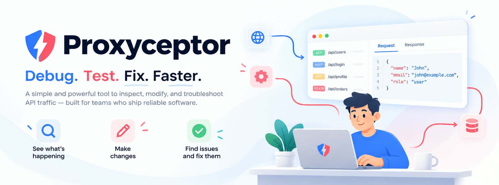

<div align="center">

<a href="https://proxyceptor.com/?utm_source=github&utm_medium=readme&utm_content=hero">
  <picture>
    <source media="(prefers-reduced-motion: reduce)" srcset="https://github.com/proxyceptor/ProxyCeptor/raw/main/assets/hero.jpg">
    
  </picture>
</a>

<h1>ProxyCeptor</h1>

<p><b>The proxy interceptor for web apps and Smart TVs.</b><br>
Mock, rewrite, delay and block any API call: in Chrome, in your JavaScript app, and on Tizen, webOS and Android TV.<br>
<b>No SSL certificates. No Wi-Fi proxy settings. No redeploys.</b></p>

<p>
  <a href="https://github.com/proxyceptor/ProxyCeptor/stargazers"></a>
  <a href="https://proxyceptor.com/?utm_source=github&utm_medium=readme&utm_content=badge"></a>
  <a href="#-quick-start"></a>
  <a href="#-works-where-certificates-cant-go"></a>
  <a href="#3-chrome-extension"></a>
  <a href="https://x.com/proxyceptor"></a>
</p>

<p>
  <a href="https://proxyceptor.com/signup?utm_source=github&utm_medium=readme&utm_content=cta_start"></a>&nbsp;
  <a href="https://proxyceptor.com/demo/?utm_source=github&utm_medium=readme&utm_content=cta_demo"></a>&nbsp;
  <a href="https://proxyceptor.com/how-to?utm_source=github&utm_medium=readme&utm_content=cta_guides"></a>&nbsp;
  <a href="https://github.com/proxyceptor/ProxyCeptor"></a>
</p>

<sub>⭐ <b>If ProxyCeptor saves you an hour, please star this repo.</b> It is the single best way to help other developers find it.</sub>

<br><br>

<p><a href="#-what-is-proxyceptor">What is it</a> · <a href="#-see-it-in-action">See it</a> · <a href="#-quick-start">Quick start</a> · <a href="#-features">Features</a> · <a href="#-how-it-works">How it works</a> · <a href="#-built-for">Built for</a> · <a href="#%EF%B8%8F-when-to-use-something-else">Compare</a> · <a href="#-faq">FAQ</a> · <a href="#-community--support">Community</a></p>

</div>

<br>

## 💡 What is ProxyCeptor?

**ProxyCeptor** (proxy + interceptor) sits between your app and the APIs it calls, so you can **see and change HTTP traffic in real time**:

- return a **mock** for an endpoint that doesn't exist yet,
- **patch one field** in a live JSON response and keep the rest,
- force a **401, 429, 500 or 503**,
- add **2 seconds of latency** to see your loading states,
- **rewrite URLs** to point production UI at staging or `localhost`,
- **block** a call to simulate an outage.

Desktop proxies like Charles, Fiddler or Proxyman work by intercepting the device's network connection, which means installing and trusting a root SSL certificate. That's painful on a laptop and often impossible on a Smart TV. **ProxyCeptor works inside the runtime instead**: in the browser through a Chrome extension, or inside your app through a small JavaScript SDK. Nothing to install on the device, no certificate to trust, no backend change to wait for.

Rules live in one **shared JSON format**. Create them once in the cloud dashboard and every teammate, browser and test TV picks them up.

| | 🧩 **JavaScript SDK** | ☁️ **Cloud workspace** | 🧪 **Chrome extension** |
| --- | --- | --- | --- |
| **For** | Any web app, plus Smart TV apps on Tizen, webOS, Android TV and Fire TV | Teams that want everyone on the same scenarios | Developers and QA working in Chrome DevTools |
| **How** | One `<script>` tag. Patches `fetch`, `XMLHttpRequest` and `sendBeacon` in memory | Dashboard at [app.proxyceptor.com](https://app.proxyceptor.com) with workspaces, profiles and API keys | A DevTools panel with rules, a network log, HAR export and session replay |
| **Status** | ✅ Live: [`proxyceptor-sdk.js`](https://proxyceptor.com/proxyceptor-sdk.js) | ✅ Live, [free to start](https://proxyceptor.com/signup?utm_source=github&utm_medium=readme&utm_content=table) | 🔜 Chrome Web Store listing coming soon |

<br>

## 🎬 See it in action

<div align="center">
<a href="https://proxyceptor.com/?utm_source=github&utm_medium=readme&utm_content=inspector#features-overview">
  
</a>
<sub><b>JSON deep merge:</b> the real server response on the left, the same response after a ProxyCeptor rule on the right. Three fields changed, everything else untouched.</sub>
</div>

<br>

<table>
  <tr>
    <td width="33%" align="center" valign="top">
      <a href="assets/screenshots/inspector-status.jpg"></a>
      <br><sub><b>Flip a status code.</b> 200 becomes 401, so you can test the session-expired flow in seconds.</sub>
    </td>
    <td width="33%" align="center" valign="top">
      <a href="assets/screenshots/inspector-delay.jpg"></a>
      <br><sub><b>Add latency.</b> 2,500 ms on one endpoint makes skeletons and spinners visible on fast Wi-Fi.</sub>
    </td>
    <td width="33%" align="center" valign="top">
      <a href="assets/screenshots/inspector-url-rewrite.jpg"></a>
      <br><sub><b>Rewrite a URL.</b> Point a production video player at a staging CDN without a new build.</sub>
    </td>
  </tr>
</table>

<p align="center">👉 <b><a href="https://proxyceptor.com/demo/?utm_source=github&utm_medium=readme&utm_content=see_it">Open the live sandbox</a></b> and run real requests through the SDK in your own browser. No sign-up needed.</p>

<br>

## 🚀 Quick start

### 1. Try it in 10 seconds (no install)

Open **[proxyceptor.com/demo](https://proxyceptor.com/demo/?utm_source=github&utm_medium=readme&utm_content=quickstart)**. The real SDK is already loaded there, with preset rules you can toggle and fire against live endpoints.

<a href="https://proxyceptor.com/demo/?utm_source=github&utm_medium=readme&utm_content=quickstart_shot"></a>

### 2. Add the SDK to any web or Smart TV app

No account needed: pass your rules inline.

```html
<script src="https://proxyceptor.com/proxyceptor-sdk.js"></script>
<script>
  const proxy = ProxyCeptor.init({
    rules: [
      {
        id: 'vip-profile',
        name: 'Every user is VIP, and the profile loads slowly',
        enabled: true,
        match: { urlPattern: '*/api/user/profile*', matchType: 'wildcard', methods: ['GET'] },
        request: { delay: 1500 },                      // 1.5 s of extra latency
        response: {
          body: { enabled: true, mode: 'merge-json', mergeValue: { is_vip: true, plan: 'premium' } }
        }
      },
      {
        id: 'checkout-down',
        name: 'Checkout returns 503',
        enabled: true,
        match: { urlPattern: '*/api/checkout*', methods: ['POST'] },
        response: {
          body: { enabled: true, mode: 'replace', statusCode: 503, value: '{"error":"maintenance"}' }
        }
      },
      {
        id: 'no-trackers',
        name: 'Block analytics',
        enabled: true,
        match: { urlPattern: '*google-analytics.com*' },
        block: true
      }
    ]
  });
</script>
```

That's it. Every matching `fetch`, `XMLHttpRequest` or `sendBeacon` call is now intercepted in memory, in any framework (React, Next.js, Vue, Angular, Svelte, plain JS) and on any browser engine your TV ships with. The SDK is ES5 with zero dependencies, about 10 KB gzipped.

**Connect it to your team instead:** create a free workspace, copy an API key, and the SDK pulls your team's rules from the cloud (and refreshes them every 5 minutes):

```js
const proxy = ProxyCeptor.init({ apiKey: 'sdm_live_your_workspace_key', showUI: true });

proxy.getAllRules();          // what's loaded right now
proxy.toggleRule('rule-id');  // flip a single rule on or off
proxy.disableProxy();         // pause all interception (enableProxy() resumes)
proxy.destroy();              // restore the original fetch / XHR / sendBeacon
```

`showUI: true` adds a small floating panel with a master switch and a checkbox per rule, so testers can switch scenarios on a TV or phone without a console.

### 3. Chrome extension

The **ProxyCeptor Chrome extension** (Manifest V3, Chrome 105+) puts everything in a DevTools panel: rules, a network log with HAR export, JavaScript/CSS snippets and a rolling session replay.

> 🔜 **The Chrome Web Store listing is coming soon.** Click **Watch → Custom → Releases** at the top of this repo to be notified the day it's live, and ⭐ star the repo so you can find it again.

### 4. Share rules with your team

1. **[Create a free workspace](https://proxyceptor.com/signup?utm_source=github&utm_medium=readme&utm_content=quickstart_team)** (no credit card).
2. Create rules in the dashboard at **[app.proxyceptor.com](https://app.proxyceptor.com)**. The rule form needs no code: enter a URL pattern, set a status, a mock body or a delay, and toggle it on.
3. Generate an **API key** and paste it into the SDK. Every app and TV using that key gets the same rules. In the extension, sign in to the same workspace.

<br>

## ✨ Features

<table>
  <tr>
    <th width="33%">⇄ Change requests</th>
    <th width="33%">⚡ Change responses</th>
    <th width="33%">⏱ Change the network</th>
  </tr>
  <tr>
    <td valign="top">
      <b>URL rewrite &amp; redirect</b>: swap hosts, paths or whole URLs (prod → staging → <code>localhost</code>)<br><br>
      <b>Header rules</b>: set or remove any request header (<code>Authorization</code>, <code>User-Agent</code>, feature flags)<br><br>
      <b>Body edits</b>: replace or deep-merge <code>POST</code>/<code>PUT</code>/<code>PATCH</code> payloads
    </td>
    <td valign="top">
      <b>Mock</b>: return any body, status and content type without calling the server (works for endpoints that don't exist yet)<br><br>
      <b>JSON deep merge</b>: change a few keys in a live response and keep everything else<br><br>
      <b>JavaScript transform</b>: a function that receives the live response and returns a new one, run in your own browser or app<br><br>
      <b>Response headers</b>: CORS, caching, cookies
    </td>
    <td valign="top">
      <b>Latency</b>: add a delay in milliseconds to any matching call<br><br>
      <b>Status override</b>: 401, 403, 404, 429, 500, 503…<br><br>
      <b>Block</b>: drop a request entirely to simulate an outage or strip trackers<br><br>
      <b>Beacons</b>: intercept <code>navigator.sendBeacon</code> analytics and telemetry
    </td>
  </tr>
  <tr>
    <th>☁️ Team &amp; cloud</th>
    <th>🔍 Debugging tools</th>
    <th>🛡️ Safety</th>
  </tr>
  <tr>
    <td valign="top">
      <b>Workspaces, profiles and API keys</b>: one rule set per team, environment or tester<br><br>
      <b>Central sync</b>: change a rule once in the dashboard and every connected browser and TV picks it up on its next refresh<br><br>
      <b>Local wins</b>: personal overrides never overwrite the shared rule set
    </td>
    <td valign="top">
      <b>Network log</b> with original vs modified data side by side, plus <b>HAR export</b><br><br>
      <b>Session replay</b> (rrweb): a rolling ~5-minute buffer you can play inline or export as one HTML file with DOM, network and console in sync<br><br>
      <b><a href="https://proxyceptor.com/test/">Commander</a></b>: a browser-based REST client with collections, cURL and HAR import, and a server-side forwarder for CORS-blocked calls
    </td>
    <td valign="top">
      <b>Fail-safe by design</b>: a broken rule, bad JSON or throwing transform falls back to the original request or response. Your app never breaks<br><br>
      <b>Traffic stays on your device</b>: interception happens in the browser or app, and the cloud only stores rule definitions<br><br>
      <b>One kill switch</b>: disable all interception with one toggle or one call
    </td>
  </tr>
</table>

<br>

## 🧠 How it works



- **In your app (SDK):** the SDK wraps `fetch`, `XMLHttpRequest` and `navigator.sendBeacon` before your code runs. Each call is matched against the rules (wildcard, regex or exact URL, plus HTTP method) and changed in memory. Because this happens inside the JavaScript runtime, HTTPS is never broken open, so there is no certificate to install.
- **In Chrome (extension):** two layers work together. Chrome's native [`declarativeNetRequest`](https://proxyceptor.com/glossary/declarativenetrequest) API handles blocking, redirects and header changes inside the browser's network stack. An in-page interceptor handles what that API can't do: response bodies, deep merges, transforms and delays.
- **In the cloud:** rules are plain JSON documents in your workspace. Clients fetch them with an API key; your traffic is never sent to the cloud.

Want the deep dive? Read **[How ProxyCeptor works behind the curtain](https://proxyceptor.com/blog/how-proxyceptor-works-behind-the-curtain)**.

<br>

## 📺 Works where certificates can't go

| Platform | How ProxyCeptor runs | SSL certificate |
| --- | --- | :---: |
| Chrome and Edge (desktop) | Chrome extension (coming soon) or the SDK in your app | ✅ Not needed |
| Any modern browser (Firefox, Safari…) | SDK in your app | ✅ Not needed |
| Samsung Tizen, LG webOS | SDK in the TV web app | ✅ Not needed |
| Android TV, Google TV, Fire TV (WebView apps) | SDK in the web layer | ✅ Not needed |
| Staging, preview deploys, `localhost` | SDK or extension | ✅ Not needed |
| Native iOS, Android or desktop apps | Not supported ([see below](#%EF%B8%8F-when-to-use-something-else)) | – |

Guides: **[Debug Smart TV apps without SSL certificates](https://proxyceptor.com/how-to/how-to-debug-smart-tv-apps-without-ssl-certificates)** · **[Mock HLS/DASH video manifests](https://proxyceptor.com/how-to/how-to-mock-streaming-video-manifests-hls-dash)**

<br>

## 👥 Built for

<div align="center">
  
</div>

<br>

| Role | What you do with ProxyCeptor |
| --- | --- |
| 🧪 **[QA engineers](https://proxyceptor.com/use-cases/qa-engineers)** | Turn "checkout returns 503", "the orders list is empty" or "the profile loads in 8 seconds" into named rules you toggle in one click, on every device. |
| 🎨 **[Frontend developers](https://proxyceptor.com/use-cases/frontend-developers)** | Keep building when the API is missing, wrong or slow. Mock the agreed contract, force error states, or point the UI at your local backend. |
| 📺 **[Smart TV & OTT teams](https://proxyceptor.com/use-cases/smart-tv-and-ott-developers)** | Mock APIs and swap video CDNs on Tizen, webOS and Android TV without certificates or Wi-Fi proxy setup. |
| 🛠️ **[Backend & API developers](https://proxyceptor.com/use-cases/backend-and-api-developers)** | Try a response change against the real frontend before you deploy it: a new field, a removed field, a new error code. |
| 🔐 **[Security testers](https://proxyceptor.com/use-cases/security-testers-and-bug-bounty)** | Keep persistent in-browser rules (swap IDs, change roles, strip headers) next to Burp or ZAP. |
| 📋 **Engineering managers** | Give the whole team one shared set of test scenarios instead of stale Charles rewrite files on every laptop. |

<br>

## ⚖️ When to use something else

We'd rather you pick the right tool. ProxyCeptor is a developer and QA tool for **web and Smart TV runtimes**; it is not a security scanner and it does not intercept closed native apps.

| If you need… | Choose | ProxyCeptor is the better fit when… |
| --- | --- | --- |
| Native iOS or macOS app debugging | **[Proxyman](https://proxyceptor.com/compare/proxyceptor-vs-proxyman)** | you work on web front ends or Smart TV web apps and QA and developers need the same scenarios |
| System-wide capture of every app on your machine | **[Charles](https://proxyceptor.com/compare/proxyceptor-vs-charles-proxy)**, **[Fiddler](https://proxyceptor.com/compare/proxyceptor-vs-fiddler)** | you want certificate-free mocking in Chrome and on TVs, with rules the whole team can use |
| Intercepting Android apps and backend processes from one desktop app | **[HTTP Toolkit](https://proxyceptor.com/compare/proxyceptor-vs-http-toolkit)** | you work in Chrome or TV web apps and want shared mock scenarios with no device setup |
| Penetration testing, scanning and fuzzing | **[Burp Suite](https://proxyceptor.com/compare/proxyceptor-vs-burp-suite)** | you're doing day-to-day development and QA (many security testers run both) |
| Versioned, code-reviewed mocks in automated tests | **[MSW](https://proxyceptor.com/compare/proxyceptor-vs-mock-service-worker)** | you're debugging by hand, running QA scenarios, demoing or reproducing bugs on devices |
| Collecting browser requests into Postman collections | **[Postman Interceptor](https://proxyceptor.com/compare/proxyceptor-vs-postman-interceptor)** | you want to change what your app receives while you develop or test |
| A browser extension that rewrites requests | **[Requestly](https://proxyceptor.com/compare/proxyceptor-vs-requestly)** | you need Smart TV support without certificates, or partial JSON deep merges instead of full-body replaces |

More: **[all comparisons](https://proxyceptor.com/compare)** · **[Charles Proxy alternatives](https://proxyceptor.com/alternatives/charles-proxy-alternatives)** · **[The 10 best proxy interceptor tools in 2026](https://proxyceptor.com/blog/best-proxy-interceptor-tools-2026)**

<br>

## ❓ FAQ

<details>
<summary><b>Do I need to install SSL certificates or change proxy settings?</b></summary>
<br>
No. ProxyCeptor runs inside the JavaScript runtime (the SDK) or uses Chrome's own extension APIs (the extension). HTTPS is never intercepted at the network level, so there is no root certificate to install and no Wi-Fi proxy to configure. That is exactly why it works on Smart TVs where certificates can't be installed.
</details>

<details>
<summary><b>Does my API traffic go to your servers?</b></summary>
<br>
No. Requests and responses are intercepted and changed locally, in the browser or on the device. Your workspace stores only rule definitions (a URL pattern, a mock body, a delay…). The one exception is opt-in: Commander's server-side forwarder relays the requests you explicitly send through it, to get around CORS.
</details>

<details>
<summary><b>Is it free?</b></summary>
<br>
You can <a href="https://proxyceptor.com/signup?utm_source=github&utm_medium=readme&utm_content=faq">create a free workspace</a> without a credit card, and the SDK works with inline rules without any account at all.
</details>

<details>
<summary><b>Which frameworks does it support?</b></summary>
<br>
All of them. ProxyCeptor intercepts <code>fetch</code>, <code>XMLHttpRequest</code> and <code>sendBeacon</code> at runtime, so React, Next.js, Vue, Angular, Svelte, Axios, TanStack Query and plain JavaScript all work without code or config changes.
</details>

<details>
<summary><b>What happens if a rule is broken?</b></summary>
<br>
Nothing bad. If mock JSON fails to parse or a transform throws, ProxyCeptor logs a warning and falls back to the original, unmodified request or response. It never crashes the page.
</details>

<details>
<summary><b>Does it work with native mobile apps, GraphQL or WebSockets?</b></summary>
<br>
<b>Native iOS/Android apps:</b> no. ProxyCeptor intercepts web runtimes (browsers, WebViews, TV web apps); for native apps use Proxyman, Charles or HTTP Toolkit.<br>
<b>GraphQL over HTTP:</b> yes. It is a normal request, so you can mock, merge, delay or fail it. Rules match on URL and method (not the operation name yet), so a rule applies to every operation on that endpoint.<br>
<b>WebSockets:</b> not yet. It's on the roadmap.
</details>

<details>
<summary><b>When is the Chrome extension on the Web Store?</b></summary>
<br>
Soon. Watch this repo (<b>Watch → Custom → Releases</b>) to hear about it first.
</details>

<br>

## 📚 Learn more

| Guides | Blog | Glossary |
| --- | --- | --- |
| [Mock API responses with custom JSON](https://proxyceptor.com/how-to/how-to-mock-api-responses-with-custom-json) | [Proxy interceptor tutorial in 5 exercises](https://proxyceptor.com/blog/proxy-interceptor-tutorial-intercept-modify-http-requests) | [What is a proxy interceptor?](https://proxyceptor.com/glossary/proxy-interceptor) |
| [Merge and append API response data](https://proxyceptor.com/how-to/how-to-merge-and-append-api-response-data) | [The frontend API error testing checklist](https://proxyceptor.com/blog/frontend-api-error-testing-checklist) | [What is API mocking?](https://proxyceptor.com/glossary/api-mocking) |
| [Simulate 500, 401 and 404 errors](https://proxyceptor.com/how-to/how-to-simulate-http-error-codes-500-401-404) | [Chrome Local Overrides vs a proxy interceptor](https://proxyceptor.com/blog/chrome-devtools-local-overrides-vs-proxy-interceptor) | [What is a MITM proxy?](https://proxyceptor.com/glossary/man-in-the-middle-proxy) |
| [Simulate network latency and delays](https://proxyceptor.com/how-to/how-to-simulate-network-latency-and-delays) | [Stop waiting for the backend: mock it](https://proxyceptor.com/blog/stop-waiting-for-the-backend-mock-it) | [What is CORS?](https://proxyceptor.com/glossary/cors) |
| [Test expired JWTs and session timeouts](https://proxyceptor.com/how-to/how-to-test-expired-jwt-tokens-and-session-timeouts) | [Debug Smart TV apps without a certificate store](https://proxyceptor.com/blog/debug-smart-tv-apps-without-a-certificate-store) | [What is SSL pinning?](https://proxyceptor.com/glossary/ssl-pinning) |
| [Share proxy rules across your team](https://proxyceptor.com/how-to/how-to-share-proxy-rules-across-engineering-teams) | [Five myths about API mocking](https://proxyceptor.com/blog/five-myths-about-api-mocking) | [What is a HAR file?](https://proxyceptor.com/glossary/har-file) |

👉 **[All 20+ how-to guides](https://proxyceptor.com/how-to)** · **[Blog](https://proxyceptor.com/blog)** · **[Glossary](https://proxyceptor.com/glossary)**

<br>

## 🤝 Community & support

| Want to… | Here's how |
| --- | --- |
| ⭐ **Star this repo** | Stars help other developers discover ProxyCeptor, and they keep a small team shipping. [Star it here ↗](https://github.com/proxyceptor/ProxyCeptor) |
| 👀 **Watch releases** | **Watch → Custom → Releases** to hear about the Chrome Web Store launch and new features. |
| 🐛 **Report a bug** | [Open a bug report](https://github.com/proxyceptor/ProxyCeptor/issues/new?template=bug_report.yml) |
| 💡 **Request a feature** | [Suggest a feature](https://github.com/proxyceptor/ProxyCeptor/issues/new?template=feature_request.yml) |
| 💬 **Ask a question** | [GitHub Discussions](https://github.com/proxyceptor/ProxyCeptor/discussions) |
| 🔒 **Report a security issue** | Privately, please: see [SECURITY.md](SECURITY.md) |
| 🐦 **Follow along** | [X / Twitter](https://x.com/proxyceptor) · [YouTube](https://www.youtube.com/@proxyceptor)  · [Instagram](https://www.instagram.com/proxyceptor/) · [Facebook](https://www.facebook.com/profile.php?id=61595134762422) |
| ✉️ **Talk to us** | [admin@proxyceptor.com](mailto:admin@proxyceptor.com) |

**Know a team that still fights with proxy certificates?** [Share ProxyCeptor on X](https://x.com/intent/post?text=ProxyCeptor%3A%20mock%2C%20rewrite%2C%20delay%20and%20block%20API%20calls%20in%20Chrome%20and%20on%20Smart%20TVs%2C%20with%20no%20SSL%20certificates.&url=https%3A%2F%2Fgithub.com%2Fproxyceptor%2FProxyCeptor) or [on LinkedIn](https://www.linkedin.com/sharing/share-offsite/?url=https%3A%2F%2Fgithub.com%2Fproxyceptor%2FProxyCeptor).

<br>

<div align="center">

<a href="https://proxyceptor.com/?utm_source=github&utm_medium=readme&utm_content=footer_logo"></a>

### Stop fighting proxy certificates.

<a href="https://proxyceptor.com/signup?utm_source=github&utm_medium=readme&utm_content=footer_start"></a>&nbsp;
<a href="https://github.com/proxyceptor/ProxyCeptor"></a>

<sub><a href="https://proxyceptor.com">proxyceptor.com</a> · <a href="https://app.proxyceptor.com">Dashboard</a> · <a href="https://proxyceptor.com/demo/">Live demo</a> · <a href="https://proxyceptor.com/test/">Commander</a> · <a href="https://proxyceptor.com/press">Press kit</a></sub>

<sub>© ProxyCeptor. Made for developers, QA teams and everyone who has ever said "works on my machine".</sub>

</div>
